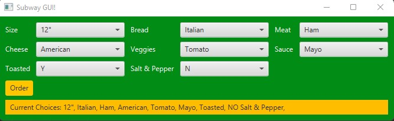

# Subway Ordering System!

A beautiful GUI interface for the international sandwich chain, Subway. 

## Example Output

## Analysis Steps

We had to make a POS system to take the order from the user for a sandwich.  
We knew that we had to create several dropdown menus with an order button and an event listener to do something when that button is clicked

### Design

To create a solution to the problem, our team decided to create three classes, the main class that displayed the program as a GUI,   
a sandmich class to hold the sandwich options,  
and a final options class to hold an option that can be picked. 

### Testing

When a change was made, we ran the program and decided if the program was doing what we thought it would    
If it wasn't we went back and made changes and if it was we celebrated and continued on 

## Notes
n/a

## Do not change content below this line
## Adapted from a README Built With

* [Dropwizard](http://www.dropwizard.io/1.0.2/docs/) - The web framework used
* [Maven](https://maven.apache.org/) - Dependency Management
* [ROME](https://rometools.github.io/rome/) - Used to generate RSS Feeds

## Contributing

Please read [CONTRIBUTING.md](https://gist.github.com/PurpleBooth/b24679402957c63ec426) for details on our code of conduct, and the process for submitting pull requests to us.

## Versioning

We use [SemVer](http://semver.org/) for versioning. For the versions available, see the [tags on this repository](https://github.com/your/project/tags). 

## Authors

* **Billie Thompson** - *Initial work* - [PurpleBooth](https://github.com/PurpleBooth)

See also the list of [contributors](https://github.com/your/project/contributors) who participated in this project.

## License

This project is licensed under the MIT License - see the [LICENSE.md](LICENSE.md) file for details

## Acknowledgments

* Hat tip to anyone who's code was used
* Inspiration
* etc
